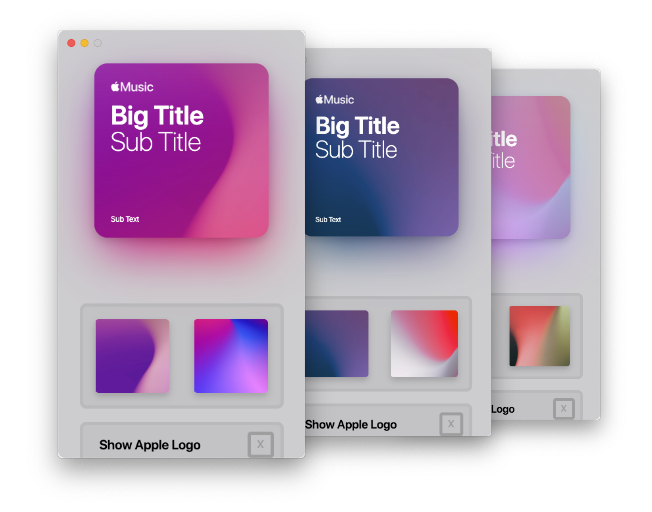

# Album Art Creator

Create amazing looking Album Art in seconds!

---

### What is this?

Album Art Creator is an app that takes your input and sends out an output album art which looks stunning. The designs very obviously resemble Apple's own album art used for the "For You" playlist's which they make.

### How to use?

Head over to the [releases page](https://github.com/0neGuyDev/albumArtCreator/releases) and download the tar file of your OS, then unzip it, macOS can do this natively iirc, unsure about Windows, most Linux distros will have the `tar` command pre-installed, use the `-x` option to extract it.

**Where's the Windows release?**

I don't have a Windows machine currently, some releases may not yet have a Windows build. If there's a current release that doesn't have a build I'd love it if you could compile it for me and send it to me!

### My Album Art doesn't show up for other people

This is a very common issue, the reason this happens is also very simple, Apple doesn't want users to act as if they made "Official Playlists" and so playlist's with Apple's logos in them won't show up on other people's devices, this is why there's a toggle for it.

### How does this work?

It's very simple actually, the app uses a framework named `Electron`, which allows developers like myself to create apps with web technologies, while also being cross-platform. Then it uses an npm module named `save-html-as-image` which as the name suggests allows me to export HTML out as an image.

### Why isn't this a website then?

Yes. This could easily be made into a website and was originally supposed to be a website, the reason it didn't end up like that is simply because my SSL license is expired, which caused issues. I'm not planning on renewing my license. However I am planning on making a seperate repository just for the web version, so if somebody wants they can host it. Or run it locally.

### What is the future of AAC?

I don't have much planned other than a few small features and probably some bug fixes once they get found. As mentioned above there's the web repository but outside of that there're no plans.

### Oi, I FOUND A BUG!

That's cool, very cool! However it shouldn't be there! Be sure to report a detailed report on the [issues page](https://github.com/0neGuyDev/albumArtCreator/issues), I haven't set up a template yet so just try to be descriptive, say how it is produced etc etc...

### This looks awesome I wanna donate to you!

That's cool and all that you feel you don't need your precious money, if you really feel I deserve some of it there's a donate button inside the app or you can use this [link](https://paypal.me/0neGuyDev)
